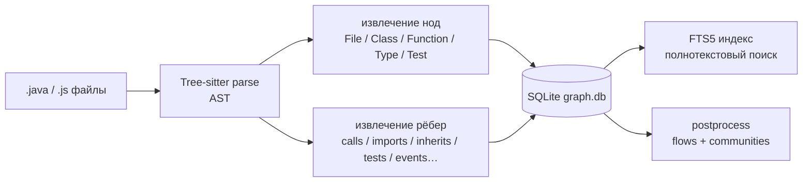
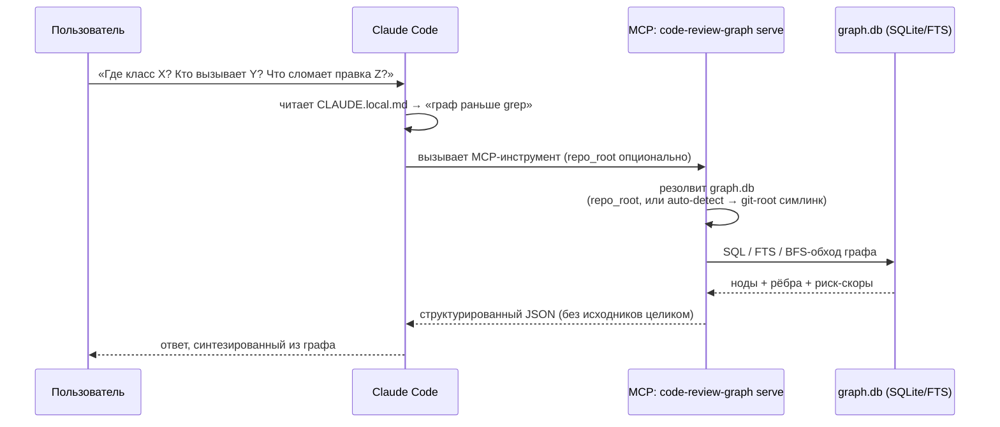

# Как работает code-review-graph в klone-mobile: от запроса до ответа

> Небольшая статья о том, что такое CRG, из чего он состоит, как обрабатывается
> запрос от пользователя до ответа ассистента, и какие вопросы он реально решает.
> Написана по факту разбора и настройки CRG в монорепо klone-mobile (CRG v2.3.7).

---

## TL;DR

**code-review-graph (CRG)** — это персистентный граф кода. Он один раз парсит проект
**Tree-sitter**'ом, раскладывает сущности (файлы, классы, функции, тесты) и связи между
ними (вызовы, импорты, наследование, тесты, события, эндпоинты…) в **SQLite**-базу
`graph.db` и потом отвечает на структурные вопросы за миллисекунды и за копейки токенов —
вместо того чтобы ассистент читал файлы целиком и трассировал зависимости глазами.

В Claude Code он подключён как **MCP-сервер**, а правило «сначала граф, потом grep»
прописано в `CLAUDE.local.md`.

---

## Из чего состоит установка

| Компонент | Что это | Где живёт |
|---|---|---|
| `code-review-graph` (v2.3.7) | CLI + MCP-сервер, ставится `uv tool install` | в PATH |
| `.mcp.json` | регистрирует MCP-сервер `uvx code-review-graph serve` (stdio, `cwd`=git-root) | корень проекта |
| `graph.db` | сама база графа (SQLite + FTS5), по одной на модуль | `<module>/src/.code-review-graph/` |
| registry | список зарегистрированных репо для кросс-репо поиска | `~/.code-review-graph/registry.json` |
| PostToolUse-хук | на каждый Edit/Write инкрементально обновляет нужный подграф | `.claude/settings.local.json` → `crg-hook-update.sh` |
| SessionStart-хук | печатает `status` графа при старте сессии | `.claude/settings.local.json` |
| симлинк `.code-review-graph` | вешает дефолтный граф на `klone-mobile-server` | корень проекта (локально, в `.git/info/exclude`) |
| правила в `CLAUDE.local.md` | «граф раньше grep», какой `repo_root` использовать | корень проекта |

Особенность монорепо: CRG собран как **6 отдельных графов** (по модулю), потому что флаг
`--repo` задаёт одновременно *что парсить* и *куда класть `graph.db`*. Дефолтный граф
(без `repo_root`) через симлинк указывает на `klone-mobile-server`
(**18 786 нод, 130 561 ребро, 2 764 файла, языки java + javascript**).

---

## Два пайплайна: сборка (offline) и запрос (online)

### Offline — как граф появляется



1. **Tree-sitter** парсит каждый исходник в синтаксическое дерево.
2. Из дерева извлекаются **ноды**: `File`, `Class`, `Function`, `Type`, `Test`.
3. И **рёбра** — статические связи: вызовы, импорты, наследование, привязка тестов,
   а также доменные (publish/listen событий, эндпоинты, триггеры шедулеров, чтение
   Spring-property).
4. Всё пишется в **SQLite** `graph.db` + строится индекс **FTS5**.
5. Postprocess считает исполнительные потоки (flows) и сообщества (communities).
6. **Инкрементально:** сборка сверяет SHA-256 файлов и перепарсит только изменённые —
   поэтому повторный `build`/`update` дёшев.

> **Про семантический поиск.** Векторные эмбеддинги (`embed`) в нашей установке
> **не включены**, поэтому `semantic_search_nodes_tool` работает в режиме `fts`
> (полнотекстовый/keyword-поиск по именам), а не по смыслу. Это видно в ответах
> инструмента: `"search_mode":"fts"`. Чтобы включить смысловой поиск, нужен
> `code-review-graph embed` с провайдером эмбеддингов.

### Online — что происходит на запрос пользователя



Ключевой момент — шаг «резолвит `graph.db`». Без `repo_root` сервер поднимается
по дереву до git-root. Если там лежит не тот граф (как было до фикса — инкрементальный
огрызок на 37 файлов), инструмент честно вернёт «0 результатов», и ассистент уйдёт
в grep. Симлинк на полный server-граф чинит именно это.

---

## Какие вопросы решает

| Вопрос | Инструмент / паттерн |
|---|---|
| Где определён класс/метод по имени? | `semantic_search_nodes_tool` (fts) |
| В каком модуле класс, если не знаю? | `cross_repo_search_tool` (по всем 6 графам) |
| Кто вызывает X? Кого вызывает X? | `query_graph_tool` `callers_of` / `callees_of` |
| Кто наследует / реализует X? | `query_graph_tool` `inheritors_of` |
| Какие тесты покрывают X? | `query_graph_tool` `tests_for` |
| Что импортирует X / кто импортирует X? | `query_graph_tool` `imports_of` / `importers_of` |
| Что внутри файла/класса? | `query_graph_tool` `children_of` / `file_summary` |
| Кто публикует / слушает событие? | `publishers_of` / `listeners_of` |
| Кто хендлит эндпоинт / какие эндпоинты у метода? | `handlers_of` / `endpoints_for` |
| Что триггерит шедулер / что он вызывает? | `triggered_by` / `triggers_of` |
| Кто читает Spring-property? | `consumers_of` |
| Что сломается, если поменять файл? | `get_impact_radius_tool`, `get_affected_flows_tool` |
| Ревью изменений с приоритетами и риск-скорами | `detect_changes_tool`, `get_review_context_tool` |
| Обзор архитектуры, кластеры, узлы-хабы | `get_architecture_overview_tool`, `list_communities_tool`, `get_hub_nodes_tool` |

---

## Граф vs Grep — зачем вообще

- **Токен-эффективность.** Grep тащит куски файлов в контекст; граф возвращает компактный
  JSON с именами, путями и связями. Дешевле и быстрее.
- **Структурный контекст.** Grep видит текст, граф видит **связи**: кто кого вызывает,
  кто наследует, какие тесты привязаны. Это то, что по тексту не найти регуляркой.
- **Импакт-анализ и ревью.** BFS по графу даёт радиус влияния изменения и риск-скоры —
  grep так не умеет в принципе.

---

## Ограничения (честно)

- **Снимок во времени.** Граф отражает состояние на момент сборки (`built_at_sha`).
  Если `head_matches_build: false` — граф отстал, нужен `update`/`build`. Инкрементальный
  хук держит его свежим только по изменяемым через Claude файлам.
- **Статический парсинг.** Tree-sitter видит синтаксис. Динамика — рефлексия, DI (Guice),
  байткод-магия — в рёбрах может быть представлена неполно.
- **Нет смыслового поиска** без `embed` (см. врезку) — только keyword/FTS.
- **6 раздельных графов.** Нужно помнить про `repo_root` / `cross_repo_search`.
  «0 хитов» почти всегда значит «класс в другом модуле», а не «класса нет».

---

## Шпаргалка

```bash
# первичная установка на машине
bash crg-setup.sh /path/to/klone-mobile

# пересобрать все 6 графов (после смены ветки / крупных изменений)
bash crg-update.sh          # из каталога проекта

# посмотреть состояние дефолтного графа
code-review-graph status
code-review-graph status --repo <путь-модуля>/src   # конкретный модуль

# список зарегистрированных репо
code-review-graph repos
```

Правило для ассистента: **сначала граф, потом grep. 0 хитов → смени `repo_root`
или используй `cross_repo_search`, и только потом Grep.**
